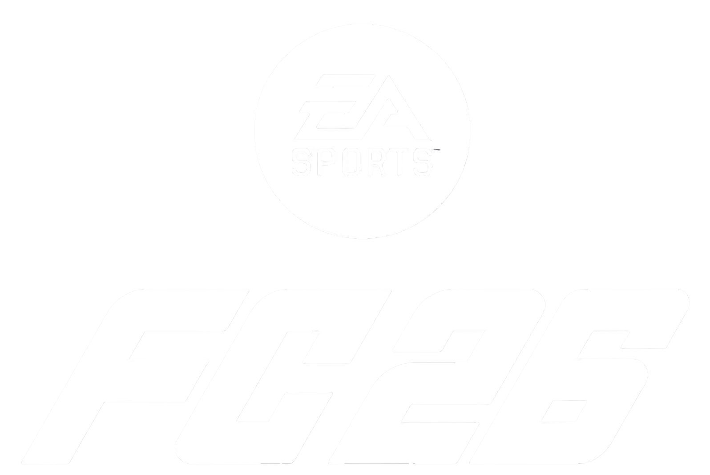

# DRAFT FC26 - Fifa World Cup 2026



## Sobre o projeto

O DRAFT FC26 é um jogo de montagem de elenco inspirado no sistema de Draft de jogos de futebol.

A ideia é montar uma equipe escolhendo jogadores disponíveis em diferentes rodadas. Cada escolha influencia diretamente a formação final, já que o jogador precisa ser compatível com a posição escolhida.

O projeto foi desenvolvido utilizando HTML, CSS e JavaScript, com os jogadores e técnicos armazenados em arquivos JSON.

O foco do projeto foi criar uma experiência simples de Draft, com cartas de jogadores, sistema de posicionamento, cálculo de GER, escolha de capitão, escolha de técnico e montagem automática do elenco final.

## Objetivo do jogo

O objetivo é montar o melhor time possível utilizando os jogadores disponibilizados durante o Draft.

Durante a partida, o jogador precisa tomar decisões levando em consideração:

* A posição do jogador
* O GER do jogador
* A compatibilidade com a posição escolhida
* A perna dominante
* Os atributos do jogador
* O técnico escolhido
* O bônus de técnico
* A escolha do capitão
* A composição da formação

No final do Draft, o jogo apresenta o elenco titular, os reservas, o capitão, o técnico escolhido e a média geral da equipe.

## Como jogar

### Início

Ao iniciar o jogo, os jogadores são carregados a partir do arquivo `jogadores.json`.

O sistema organiza os jogadores disponíveis e inicia as rodadas do Draft.

A cada rodada são apresentadas cartas para escolha.

O jogador seleciona uma carta e depois precisa definir onde aquele jogador será utilizado dentro da formação.

### Escolha do capitão

Em uma etapa específica do Draft, o jogador escolhe o capitão da equipe.

O capitão possui uma posição própria dentro da lógica do jogo e é identificado separadamente no elenco final.

### Escolha dos jogadores

As cartas disponíveis são apresentadas dinamicamente.

Ao escolher um jogador, ele deixa de estar disponível para as próximas escolhas.

Isso impede que o mesmo jogador seja utilizado mais de uma vez durante o Draft.

### Posicionamento

Depois de escolher um jogador, o sistema verifica se ele pode atuar na posição selecionada.

Caso a posição seja compatível, o jogador é colocado no campo.

Caso não seja compatível, o posicionamento não é permitido.

O sistema também calcula o GER considerando a posição em que o jogador foi colocado.

### Formação

A formação utilizada no resultado final é baseada em um esquema 4 3 3.

A equipe titular possui:

* 1 goleiro
* 4 defensores
* 3 jogadores de meio campo
* 3 jogadores de ataque

Além dos titulares, os jogadores restantes selecionados durante o Draft aparecem como reservas.

## Jogadores por posição

A base de jogadores é organizada pelas seguintes posições:

| Posição | Função                  |
| ------- | ----------------------- |
| GK      | Goleiro                 |
| LD      | Lateral direito         |
| LE      | Lateral esquerdo        |
| ZAG     | Zagueiro                |
| MD      | Meio campista defensivo |
| MEI     | Meio campista           |
| PD      | Ponta direita           |
| PE      | Ponta esquerda          |
| ATA     | Atacante                |

A quantidade total de jogadores disponível em cada posição é definida diretamente pelo arquivo `jogadores.json`.

Isso permite aumentar ou diminuir o tamanho da base sem precisar alterar a lógica principal do jogo.

## Regras de posição

Cada jogador possui uma posição original.

O sistema verifica essa posição antes de permitir o posicionamento.

A posição também influencia o cálculo do GER final.

Dessa forma, um jogador pode possuir um GER alto na sua posição original, mas apresentar um valor diferente quando utilizado fora dela.

Isso faz com que a escolha das cartas não seja baseada somente no maior GER.

O jogador precisa considerar também onde aquela carta poderá ser utilizada.

## Categorias utilizadas

As posições são divididas em grupos de acordo com a função dentro do campo.

### Goleiro

GK

### Defesa

LD

LE

ZAG

### Meio campo

MD

MEI

### Ataque

PD

PE

ATA

Essa divisão é utilizada pelo sistema para determinar a compatibilidade dos jogadores com os espaços disponíveis na formação.

## Sistema de GER

O GER representa a classificação geral do jogador.

O valor é calculado pelo sistema a partir das informações presentes nos dados do jogador.

Quando o jogador é posicionado em campo, o sistema calcula novamente o valor considerando o espaço escolhido.

Isso permite que o mesmo jogador tenha desempenhos diferentes dependendo da posição.

## Bônus de perna dominante

A perna boa do jogador também faz parte dos dados utilizados pelo projeto.

Essa informação pode ser utilizada pelo sistema para diferenciar jogadores e suas características dentro do Draft.

O objetivo é aproximar a lógica de montagem de elenco de jogos de futebol onde a posição e a perna dominante influenciam a utilização do jogador.

## Escolha do técnico

Depois das escolhas de jogadores, o sistema trabalha com técnicos disponíveis no arquivo `tecnicos.json`.

Cada técnico possui um estilo de atuação.

Os estilos utilizados atualmente são:

### Ofensivo

O técnico ofensivo concede bônus para jogadores de ataque.

### Defensivo

O técnico defensivo concede bônus para jogadores defensivos e goleiros.

### Equilibrado

O técnico equilibrado concede bônus para jogadores do meio campo.

O bônus é aplicado quando o jogador é posicionado no campo.

## Como o técnico influencia o GER

O bônus do técnico é aplicado de acordo com o estilo selecionado.

A lógica utilizada atualmente é:

```text
Ofensivo
ATA recebe +1

Defensivo
DEF ou GK recebe +1

Equilibrado
MEI recebe +1
```

Esse sistema foi separado em uma função própria para facilitar alterações futuras.

## Cartas de jogadores

As cartas são criadas dinamicamente pelo JavaScript.

Cada carta utiliza os dados do jogador para apresentar as informações necessárias na interface.

Entre as informações utilizadas estão:

* Nome
* Posição
* GER
* Perna boa
* Altura
* Peso
* Idade
* Pé ruim
* Skills
* Tipo da carta
* Atributos

As informações são carregadas a partir dos arquivos JSON e utilizadas para montar a interface.

## Dados dos jogadores

O arquivo `jogadores.json` concentra os jogadores utilizados no Draft.

Cada jogador possui informações que são normalizadas antes de serem utilizadas pelo restante da aplicação.

Entre os dados disponíveis estão:

```text
nome
posicao
pernaBoa
altura
peso
idade
peRuim
skills
tipoCarta
capitaoElegivel
atributos
```

O sistema também calcula o GER do jogador antes de disponibilizá lo para a interface.

## Dados dos técnicos

Os técnicos ficam armazenados no arquivo `tecnicos.json`.

Cada registro possui as informações utilizadas pelo sistema para identificar o técnico e determinar o bônus aplicado ao elenco.

A separação dos dados em JSON permite modificar jogadores e técnicos sem precisar alterar a estrutura principal do JavaScript.

## Controle do estado do jogo

O jogo mantém um estado interno para controlar as informações da partida.

Entre os dados controlados estão:

* Jogadores disponíveis
* Jogador selecionado
* Rodada atual
* Ordem do Draft
* Posição selecionada
* Capitão
* Técnico
* Jogadores posicionados
* Jogadores titulares
* Jogadores reservas

Quando uma escolha é confirmada, o estado é atualizado e o jogador selecionado é removido da lista de jogadores disponíveis.

## Sorteio das cartas

As cartas apresentadas durante o Draft são selecionadas a partir dos jogadores disponíveis.

Depois que uma escolha é confirmada, o jogador deixa de fazer parte das opções disponíveis.

Isso mantém o Draft controlado e evita duplicações.

## Compatibilidade de jogadores

Antes de confirmar uma posição, o sistema verifica se o jogador selecionado pode atuar naquele espaço.

Essa validação é feita antes de alterar o elenco.

O objetivo é evitar situações em que um jogador incompatível seja colocado em uma posição que não faz sentido dentro das regras do jogo.

## Capitão

O sistema possui uma regra específica para jogadores elegíveis a capitão.

A propriedade `capitaoElegivel` determina quais jogadores podem assumir essa função.

O capitão é armazenado separadamente e aparece identificado no resultado final da equipe.

## Resultado final

Quando todas as escolhas necessárias são concluídas, o Draft é finalizado.

O resultado apresenta:

* Formação titular
* Jogadores reservas
* Capitão
* Técnico
* GER dos jogadores
* Média geral da equipe

A média geral é calculada utilizando os jogadores titulares.

A formação final é renderizada visualmente em um campo utilizando a estrutura 4 3 3.

## Estrutura do projeto

```text
DRAFT FC26

index.html
script.js
data.js
jogadores.json
tecnicos.json
logo.webp
```

## `index.html`

O `index.html` é responsável pela estrutura principal da aplicação.

Nele ficam os elementos utilizados para apresentar:

* Tela inicial
* Cartas
* Área de seleção
* Campo
* Formação
* Resultado final
* Informações do jogador
* Informações do técnico

O JavaScript utiliza esses elementos para atualizar a interface durante o jogo.

## `data.js`

O `data.js` concentra a lógica relacionada aos dados.

Ele é responsável principalmente por carregar e preparar os jogadores e técnicos.

Entre suas funções está `pegaJogadores`, que busca os jogadores no arquivo JSON e normaliza os dados antes de utilizá los.

Também existe a função responsável pelo bônus dos técnicos.

Manter essa parte separada facilita a manutenção da aplicação e evita concentrar toda a lógica em um único arquivo.

## `script.js`

O `script.js` controla o funcionamento do Draft.

Ele gerencia:

* Rodadas
* Seleção de cartas
* Jogador selecionado
* Posicionamento
* Validação de posição
* Capitão
* Técnico
* Atualização do campo
* Elenco final
* Reservas
* Cálculo da média da equipe

Também é responsável por gerar partes da interface de forma dinâmica.

## Tratamento das imagens

As imagens dos jogadores são utilizadas diretamente pela interface.

O sistema possui tratamento para situações em que uma imagem não esteja disponível ou não consiga ser carregada.

Isso evita que uma carta fique quebrada visualmente por causa de uma imagem ausente.

## Tecnologias utilizadas

### HTML

Utilizado para estruturar as telas e os elementos da aplicação.

### CSS

Utilizado para construir o visual do jogo, cartas, campo, botões, menus e demais elementos da interface.

### JavaScript

Responsável por toda a lógica do Draft e pela atualização dinâmica da página.

### JSON

Utilizado para armazenar os jogadores e técnicos.

## Como executar

O projeto pode ser executado diretamente no navegador.

Basta baixar ou clonar o projeto e abrir o `index.html`.

Como os dados são carregados através de arquivos JSON, dependendo do navegador e da forma como o projeto for aberto, pode ser necessário utilizar um servidor local.

Uma opção simples é utilizar uma extensão de servidor local no editor de código.

Também é possível utilizar qualquer servidor HTTP local.

## Decisões de implementação

A separação entre dados e lógica foi uma das principais decisões do projeto.

Os jogadores ficam em `jogadores.json`.

Os técnicos ficam em `tecnicos.json`.

A preparação desses dados fica em `data.js`.

A lógica do jogo fica principalmente em `script.js`.

A interface fica estruturada no `index.html` e estilizada pelo CSS.

Essa divisão facilita alterações na base de jogadores sem exigir mudanças na lógica do Draft.

## Possíveis evoluções

O projeto pode receber novas funcionalidades futuramente, como:

* Mais formações
* Mais posições
* Sistema de química
* Clubes e seleções
* Ligas
* Novos tipos de cartas
* Mais estilos de técnicos
* Sistema de raridade
* Mercado de jogadores
* Histórico de Drafts
* Salvamento do elenco
* Sistema de pontuação
* Modo multiplayer
* Ranking
* Animações adicionais
* Novas regras de compatibilidade

## Estrutura geral do funcionamento

O fluxo principal do jogo pode ser resumido da seguinte forma:

```text
Carregar jogadores
       |
       v
Carregar técnicos
       |
       v
Iniciar Draft
       |
       v
Apresentar cartas
       |
       v
Escolher jogador
       |
       v
Validar posição
       |
       v
Posicionar jogador
       |
       v
Atualizar estado
       |
       v
Próxima rodada
       |
       v
Escolher técnico
       |
       v
Finalizar Draft
       |
       v
Montar formação 4 3 3
       |
       v
Exibir resultado
```

## Objetivo do projeto

O DRAFT FC26 foi desenvolvido como um projeto prático para trabalhar principalmente com manipulação do DOM, gerenciamento de estado, consumo de dados JSON, regras de negócio e criação de interfaces dinâmicas utilizando JavaScript puro.

A ideia é manter o projeto simples de executar e fácil de modificar, deixando a base de jogadores e técnicos independente da lógica principal do jogo.

## Créditos

Projeto desenvolvido por Marcos.

Repositório:

https://github.com/marcos-dev86/DRAFT-FC26

## Licença

Este projeto é disponibilizado para fins de estudo e desenvolvimento.

Verifique o repositório para informações adicionais sobre utilização, distribuição e possíveis restrições relacionadas aos dados e imagens utilizados no projeto.
